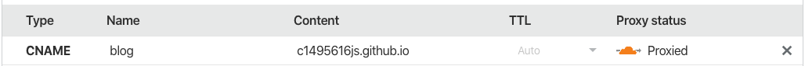

# Personal Blog

## Add article

```
npm run new <title-you-want>
```

## github action

I use [gatsby action](https://github.com/enriikke/gatsby-gh-pages-action).
And there's a bug, so need to add in `package.json`.
`"build": "gatsby build --prefix-paths",`

## Domain

### gastby

- in `gatsby-config.js`:

```js
pathPrefix: "/blog" // original: repo name
pathPrefix: "/" // custom domain
```

- add `CNAME` to `static` folder **custom domain**

example:

```
blog.c1495616.xyz
```

### cloudflare **custom domain**



### Ref

https://www.gatsbyjs.org/docs/how-gatsby-works-with-github-pages/
