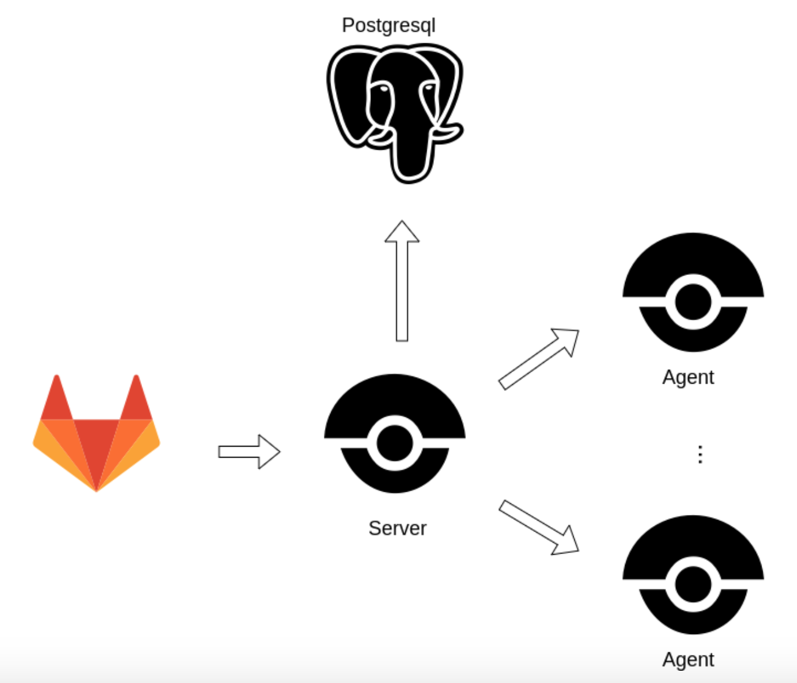
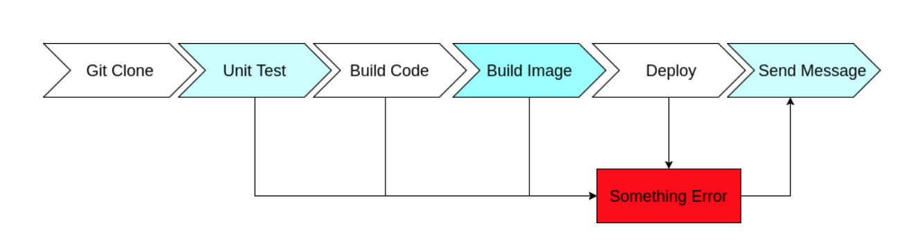
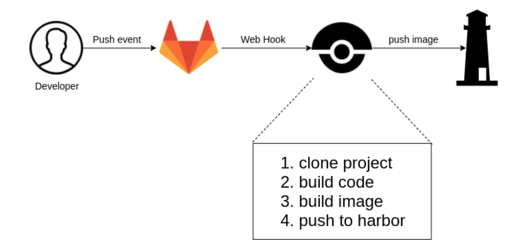

# [Drone](https://drone.io/)

## Introduction

> We love docker. And Drone builds anything in docker.
>
> Drone is a CI/CD tool built by Golang. It's light weight and fast and easily built with `docker-compose`.

- Build anything in docker. When building completed, it deletes all containers and left no garbage file in machine.

- Easy to learn and maintain.
- Use `.drone.yml` to trigger CI/CD pipeline, which means you can have version control.
- Using container to run all steps of pipeline, so it supports every language.
- Widely supports many repository services, like `gitlab`, `github`, `gitea`, `bitbucket`

### Structure of system

Drone uses `webhook` to trigger deployment, received by `Drone Server`. And `Drone Server` will allocate job to `Drone Agent` to execute pipeline.


### Deployment Steps

- Unit Test
- Build Code
- Build Image
- Deploy
- Success/Failure Notification
  

## Installation

// TODO

## How to write `.drone.yml`

// TODO

```yml
kind: pipeline
type: docker # 在 running docker in pipeline
name: clone # The name you can define yourself

steps:
  # Task 1
  - name: host
    image: alpine
    commands:
      - cat /etc/hosts
    when:
      status: [success, failure]
  # Task 2
  - name: echo
    image: plugins/git
    commands:
      - echo "78523"
    when:
      branch:
        - master
  # Task 3
  - name: dev_action
    image: plugins/git
    commands:
      - echo "111111"
    when:
      branch:
        - develop

trigger:
  branch:
    - master
  event:
    - push
```

## Drone Plugins

// TODO

## Build Images



## Next Step? Drone + Kubernetes

// TODO
