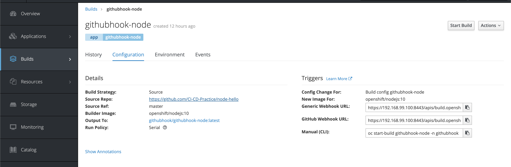
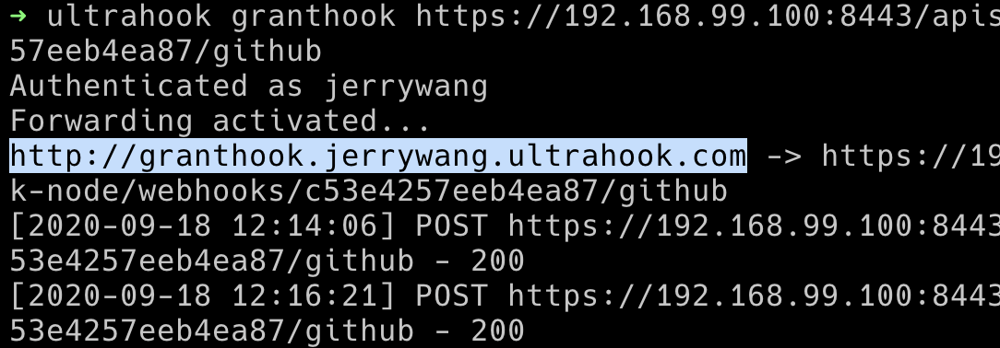
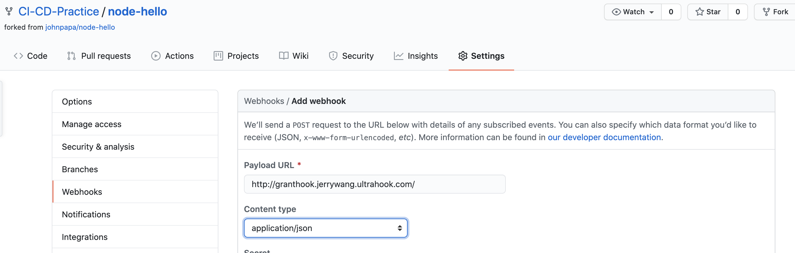

## Trouble Shooting

Error starting the VM: Error getting the state for host: machine does not exist

https://github.com/minishift/minishift/issues/882

## Develop

- install virtualbox

note: in system preference/security and privacy/ allow


```
brew cask install virtualbox

```

- install minishift

```
brew cask install minishift
```


## WebHook

For using webhook in local environment from Github, we introduce the [ultrahook](http://www.ultrahook.com/).

[video tutorial](https://www.youtube.com/watch?v=--wNO4lV6WA)

- Install:

```
gem install ultrahook
```

- Usage:

1. find the webhook url from minishift.



2.

```
ultrahook <name> <webhook url from minishift>
```



3. Add the url from terminal to the repo.
   For example: `http://granthook.jerrywang.ultrahook.com/`
   

## Ref

https://docs.okd.io/latest/minishift/getting-started/quickstart.html
