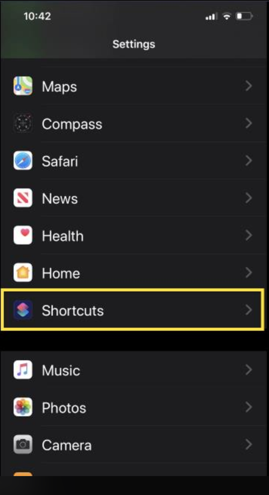
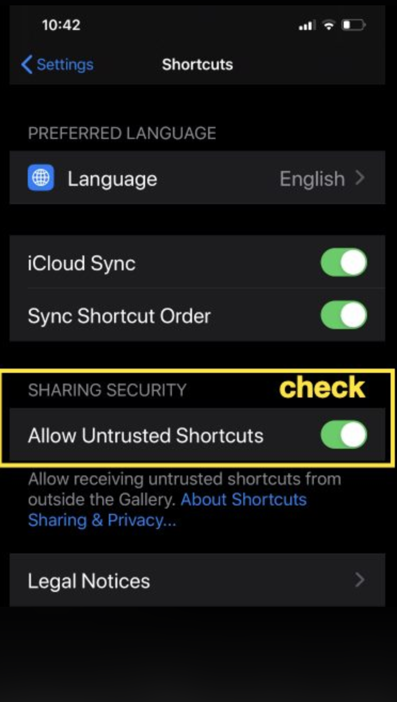
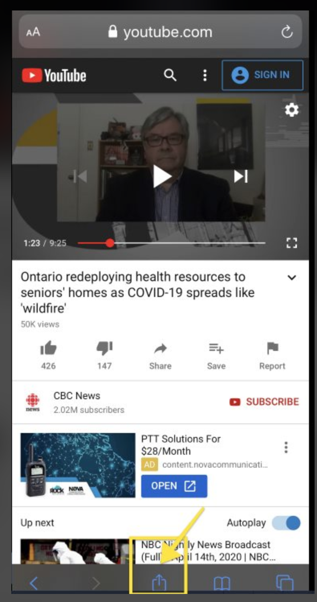
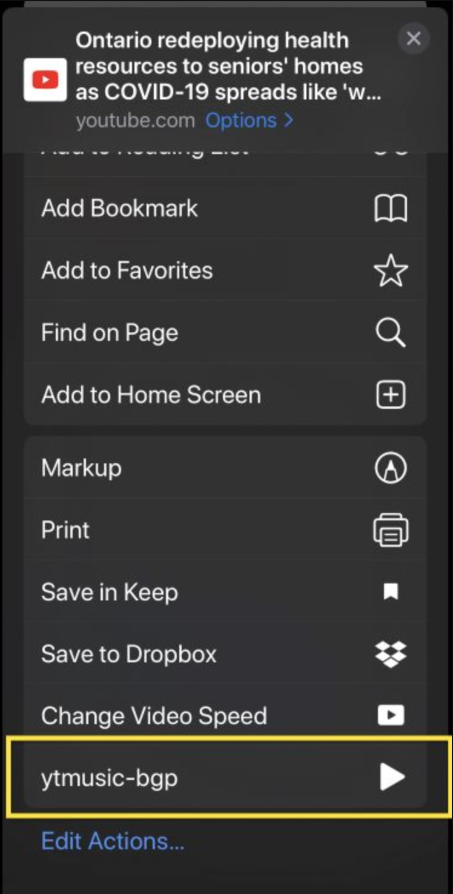
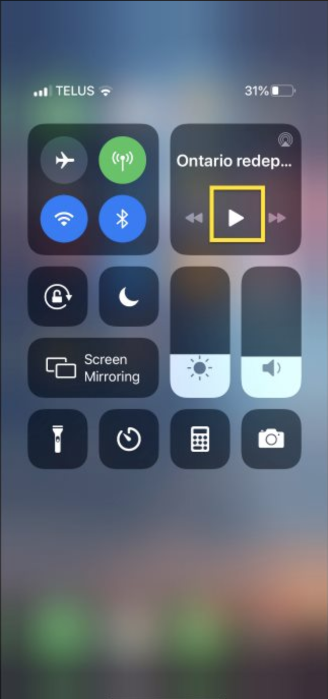

Want to share how to play youtube in background without any app if you use iPhone.
分享一個 iphone 用 safari 開啟 youtube，並在背景播放音樂的方法。

1. settings / shortcut (設定 / 捷徑)
2. Toggle the switch on "Allow Untrusted Shortcut" (開啟 允許未知的捷徑)
   If you don't see this switch or it's disabled, you could open the "shortcut app" and click on any shortcut.
   (如果你沒看到這個選項或是他是鎖住的，就先前往 shortcut 這個 app，隨便點一個來用）
3. install this shortcut via the following link. 點擊這個網址來安裝這個捷徑(https://www.icloud.com/shortcuts/cac7206e04eb49138e7dda8f317a2348)
4. open safari and navigate to youtube and click on sharing button. (使用 safari 並前往 youtube 網頁 並按下下方的 "分享" 按鈕)
5. select the shortcut we just install from step 3.
   (選擇我們剛剛步驟 3 安裝的捷徑)
6. play youtube and go back to home screen
   (播放任意影片，並回到手機桌面)
7. go to the control panel and play
   (右上角拉下來進入控制中心，並播放音樂)
   這個捷徑我看過 js 程式，非常安全。
   If you want to know the theory behind this, please refer to the repo.
   shorturl.at/agX69
   and article:
   shorturl.at/dnJU0

- step 1:
  

- step 2:
  

- step 4:
  

- step 5:
  

- step 7:
  
